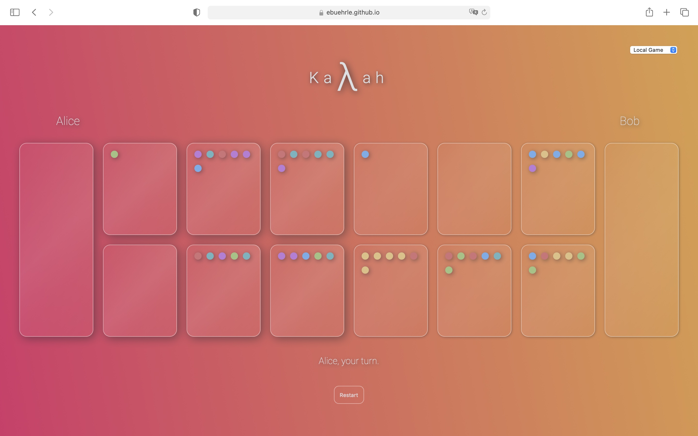

Vanilla JS implementation of the meditative two-player strategy board game [Kalaha](en.wikipedia.org/wiki/kalah) (also known as *Kalah* or *Mancala*).

Try it out at [ebuehrle.github.io/kalaha](https://ebuehrle.github.io/kalaha)